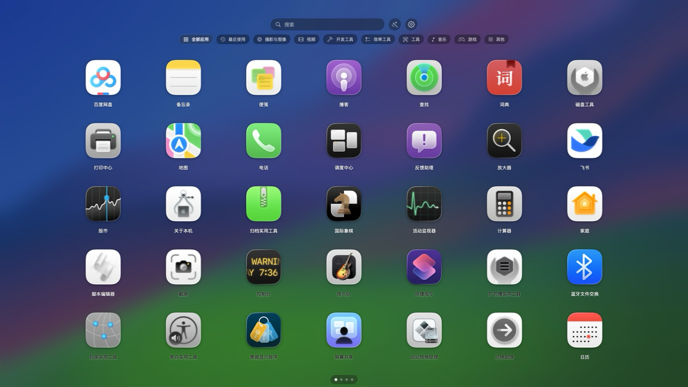
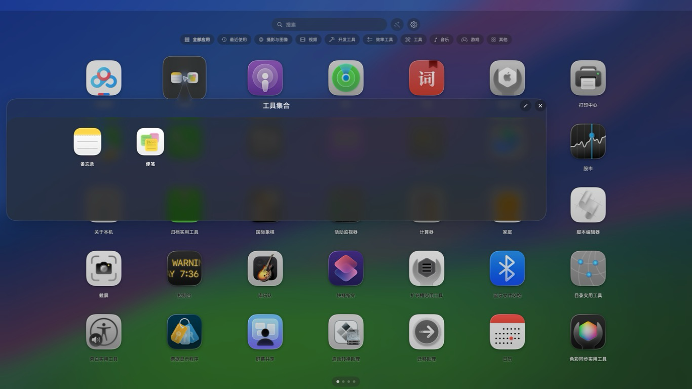

# LaunchDeck

<p align="center">
  
</p>

> 一个使用 SwiftUI + AppKit 打造的 macOS 原生启动台，让应用浏览、搜索、分类和整理回到轻快、直观的桌面体验。

LaunchDeck 当前版本为 **1.9.30**，最低支持 **macOS 13**；在 macOS 26 上使用官方 Liquid Glass 视觉语言，并为较早系统提供原生材质降级方案。

## 开发背景

随着 Mac 上安装的应用越来越多，仅依靠 Finder、Spotlight 或 Dock 很容易在“找到应用”和“整理应用”之间来回切换。LaunchDeck 的开发目标，是做一个保持 macOS 原生气质的轻量启动台：打开即浏览，输入即可定位，拖动即可整理，不把用户的应用列表上传到云端，也不要求额外账号。

这个项目同时也是一次对 macOS 原生能力的实践，重点探索了 SwiftUI 与 AppKit 的协作、连续触控板分页、高刷新率动画、屏幕刘海安全区、桌面壁纸毛玻璃和系统级拖放等体验细节。

## 项目介绍

LaunchDeck 会读取本机常见应用目录，生成可分页的启动台网格。它保留经典 Launchpad 的大图标和留白比例，同时加入更适合现代 macOS 的功能：单行分类导航、按整台 Mac 使用频率排序的最近使用、静默多键搜索、一键智能归类、应用文件夹、拖入 Dock、永久卸载以及登录启动。

应用名称会优先使用中文本地化名称；没有中文资源的应用保留其原始英文名称。界面背景会读取当前 Space 正在显示的纯壁纸表面，再在启动台窗口内生成毛玻璃和局部明暗适配；桌面图标与其他应用窗口不会被带入，内容会按照显示器实际尺寸、缩放比例和刘海安全区域自动布局。

## 功能展示

| 功能 | 使用方式 | 体验重点 |
| --- | --- | --- |
| 应用浏览 | 打开 LaunchDeck 后按页查看本机应用 | 经典 7×5 网格、自动分页、支持 Apple Silicon 与 Intel |
| 分类与最近使用 | 点击搜索栏下方整枚分类胶囊 | “全部应用”之后依次显示“最近使用”和实际分类；单个分类超出一页时在该分类内继续分页，最近使用按整台 Mac 的时间衰减频率排序 |
| 标准搜索 | 点击搜索栏后输入 | 完整兼容 macOS 中文输入法、拼音候选和清除操作 |
| 静默搜索 | 搜索栏未聚焦时直接按键，例如 `p`、`s` | 自动累积为 `PS`，筛选名称中包含对应内容的应用，不占用搜索栏 |
| 文件夹 | 将一个图标拖到另一个图标上 | 在当前页面叠放小窗口打开，可命名、重命名、继续拖入或拖出 |
| 连续翻页 | 使用触控板左右滑动或鼠标滚轮 | 页面跟随手指移动，可反向拖回，不必等待上一页动画结束 |
| 高刷新率动画 | 在支持高刷的显示器上使用 | 根据当前显示器申请 120Hz、144Hz 等刷新率；点击、翻页和开合在操作完成后的首帧开始过渡 |
| Dock 拖放 | 按住图标拖向屏幕底部或左右边缘 | 启动台自动退开，把应用以原生文件 URL 交给 Dock |
| 永久卸载 | 将第三方应用拖到卸载区域并确认 | 删除应用本体及可明确归属的用户数据；权限不足时调用 macOS 授权对话框 |
| 沉浸式显示 | 打开启动台 | 背景铺满屏幕并隐藏菜单栏，鼠标划到底部仍可显示 Dock |
| 屏幕适配 | 在刘海屏、外接屏或更换分辨率后使用 | 根据 AppKit 运行时安全区域重新布局，不硬编码机型尺寸 |
| 登录启动 | 在设置中开启 | 使用 `SMAppService.mainApp` 注册登录项，并显示真实系统状态 |

## 界面截图

### 应用网格与搜索


主界面采用壁纸融合背景、大图标网格和顶部搜索入口。应用名称优先显示中文本地化结果，英文应用保留原名。

### 文件夹浮层



文件夹直接以当前页面上的浮层打开，背景中的应用不会切换到二级页面。用户可以在浮层中继续拖入应用，也可以把应用拖到浮层外移出文件夹。

## 技术路线

- **界面**：SwiftUI；窗口、触控、拖放和系统交互使用 AppKit。
- **动画**：Core Animation、AppKit 连续滑动事件和 SwiftUI 弹簧动画。
- **视觉**：macOS 26 使用 `glassEffect` / `GlassEffectContainer`；壁纸背景先读取 Dock 当前 Space 的 `Wallpaper-` 纯壁纸窗口（不抓取整屏），再交给本窗口内的原生 `NSVisualEffectView(.withinWindow)` 做毛玻璃，旧系统仍使用公开材质降级。
- **应用发现**：在后台扫描 `/Applications`、`/System/Applications`、系统公共应用目录和 `~/Applications`，读取图标、Bundle ID、本地化名称和分类；兼容 macOS 通过符号链接暴露的系统应用。冷启动先建立窗口并开始动画，后续刷新保留可交互的缓存网格。
- **应用活动**：应用启动时通过公开的 `NSWorkspace.didActivateApplicationNotification` 注册一次全局激活监听；窗口隐藏后仍继续记录，退出 LaunchDeck 时才停止。
- **系统使用记录**：最近使用以本次登录期间收集的激活事件为主，按 7 天半衰期计算动态分数；首次初始化时最多从 Spotlight 的 `kMDItemLastUsedDate` 为每个应用建立一条低权重兼容记录，不读取或依赖长期累计的 `kMDItemUseCount`。
- **本地数据**：最近使用事件、文件夹和偏好设置保存在本机 `UserDefaults`；事件至少保留 90 天并有总量上限。项目不依赖云端账号。
- **安全边界**：壁纸只取 Dock 的纯壁纸表面，不包含桌面图标或其他应用窗口；不修改系统 Launchpad 数据库，系统应用受保护，卸载前会再次校验路径和 Bundle ID。

## 当前状态

- 当前版本：`1.9.30 / build 42`
- 支持系统：macOS 13 及更高版本
- 首次启动会说明权限范围；当前功能不申请辅助功能、屏幕录制或完全磁盘访问。壁纸不可用时会安全降级为实色背景，受保护应用的管理员授权仅在用户明确确认卸载时按需出现。
- 架构：`arm64` + `x86_64` 通用构建
- 作者：**薯条stars / He Yi**
- 验证记录：[Tests/VERIFICATION.md](Tests/VERIFICATION.md)

## 构建与运行

推荐运行完整签名的本机 Release 版：

```bash
bash Scripts/build-release.sh
open dist/LaunchDeck.app
```

脚本生成 `dist/LaunchDeck.app`，对完整 bundle 做本机 ad-hoc 签名并验证完整性；不修改系统登录项。它不是 Developer ID 签名或公证版本，向其他 Mac 分发时仍需开发者自己的签名与公证。请不要直接拿只带链接器签名的 Debug 产物验证系统登录项。

制作可交给其他 Mac 使用的拖拽安装镜像：

```bash
bash Scripts/package-dmg.sh
open dist/LaunchDeck-1.9.30.dmg
```

生成的 DMG 内含 `LaunchDeck.app` 和 `Applications` 快捷入口，将应用拖入即可安装；本机生成的 DMG 文件、挂载后的磁盘卷和其中的应用均使用 LaunchDeck 图标。某些下载或传输方式会剥离 DMG 文件自身的 Finder 扩展属性，但挂载后的卷和应用图标不受影响。当前包仍是本机 ad-hoc 签名，不是 Developer ID 签名或公证版本；首次打开时如果被 Gatekeeper 拦截，请在“系统设置 → 隐私与安全性”中允许，或使用自己的 Developer ID 签名并公证后再分发。

调试构建：

```bash
xcodebuild -project LaunchDeck.xcodeproj \
  -scheme LaunchDeck \
  -configuration Debug \
  -derivedDataPath build/DerivedData \
  CODE_SIGNING_ALLOWED=NO build

open build/DerivedData/Build/Products/Debug/LaunchDeck.app
```

工程部署目标为 macOS 13.0，优先面向 Apple Silicon。

## 发布到 GitHub

建议将源代码和 `docs/screenshots/` 一起提交到 GitHub；将安装包放在 GitHub Releases 的附件中，用户可以直接下载对应版本的 DMG。

当前脚本生成的 DMG 是本机 ad-hoc 签名版本，适合开发测试和源码展示，不是面向公众发布的 Developer ID 签名或公证版本。正式分发前，需要使用自己的 Apple Developer 账号完成 Developer ID 签名和公证，否则其他 Mac 可能会看到 Gatekeeper 安全提示。

## 开源许可

当前仓库尚未附带 `LICENSE` 文件。若希望允许他人自由修改和分发，请在公开仓库前选择并添加合适的开源许可证；在添加许可证之前，默认不授予仓库代码额外的开源使用权限。

## 已实现

- 扫描 `/Applications`、`/System/Applications`、系统公共应用目录和 `~/Applications`；兼容 Safari 等通过符号链接暴露的应用
- 读取 App 名称、图标、路径、Bundle ID 和 Launch Services 分类；应用名称优先显示中文本地化名称，没有中文资源时保留软件原本的英文名称
- 每次打开启动台都在后台重新扫描，避免应用安装、更新或移动后仍显示旧列表；冷启动不等扫描才开始展示，已有列表刷新时不替换为加载画面；可启动的菜单栏应用也会保留，纯后台辅助进程不显示
- 自动分页、AppKit 原生连续滑动与 Core Animation GPU 合成翻页，按当前显示器申请 120 / 144Hz 等原生刷新率
- 参考本机 HotLaunch 的经典 7×5 网格、图标比例与横向留白；小屏自动缩放或减少行数
- 沉浸式背景延伸至系统菜单栏下层，搜索、分类和图标仍避开菜单栏与刘海；设置齿轮紧邻搜索栏右侧
- 运行时读取每个显示器的点尺寸、像素尺寸、缩放倍率、visible frame、safe area 和刘海两侧可用区域；不硬编码 Mac 机型，换屏、换分辨率或未来刘海形态会自动重算
- 打开启动台时覆盖整个物理屏幕并进入 AppKit 的自动隐藏菜单栏和 Dock 模式；菜单栏/状态栏保持隐藏，鼠标划到底部时由系统显示 Dock，收起、打开设置、失去焦点或退出时恢复原状态
- 原生 Liquid Glass 搜索栏、分类控件和页码，跟随系统深浅外观；当前 Space 的纯壁纸表面位于窗口内，顶部自然过渡到毛玻璃，不固定压暗，也不透出桌面图标
- 按壁纸局部亮度自动选择应用名称的深浅文字；打开期间自动检测壁纸文件与布局变化，收起后停止轮询
- 非线性缩放/淡入淡出开合，点击空白关闭；点击判定完成后，收起动画在下一显示帧直接产生明显位移与淡出，启动动画尚未结束时也无需等待。点击应用时先提交收起动画，再请求 Launch Services 启动目标，遵循“减少动态效果”和“减少透明度”
- 单行分类导航：“全部应用”在最前，后面依次为“最近使用”和实际存在的具体分类，无二级模式开关
- 最近使用常驻监听整台 Mac 的应用激活事件；以 7 天半衰期的实时事件分数排序，不以 Spotlight 长期累计次数或 LaunchDeck 内启动顺序作为主数据源
- 应用活动按 Bundle ID 和规范化路径持久化；应用移动后可复用历史，重复激活在 60 秒内只计一次，系统元数据首次兼容初始化每个应用最多一条低权重记录
- 标准 macOS 搜索框、全局内存筛选、清除、Esc 退出和搜索前页面恢复
- 静默连续检索：图标区域按键会累积为查询词，不写入或聚焦搜索栏；例如依次按 `p`、`s` 会筛选名称中包含 `ps` 的应用，并兼容拼音和顺序缩写
- 原生拖动第三方 App 到“卸载应用”区域，二次确认后永久删除 `.app` 本体，不进入废纸篓
- 系统路径 App 受保护；普通删除遇到权限不足时由 macOS 弹出管理员授权对话框，LaunchDeck 不读取、保存或代填密码，也不修改文件权限或使用私有 API
- 原生文件 URL 拖放至 Dock；鼠标触底可显示 Dock，拖拽到下方、左侧或右侧边缘时启动台自动退开
- 将一个应用图标拖到另一个应用或文件夹图标即可叠放成 LaunchDeck 文件夹；文件夹只保存应用 ID 元数据，支持命名、重命名、在当前页面以浮层打开、拖出和继续拖入应用
- `SMAppService.mainApp` 登录启动开关、真实系统状态与失败原因
- 菜单栏入口和独立设置窗口；隐藏启动台后仍可唤起
- 设置中的“关于 LaunchDeck”显示作者“薯条stars / He Yi”，应用元数据同时保留作者与版权信息
- 全局原始触控板四指向内捏合打开、向外散开关闭（需要真实触控板验收）
- `launchdeck://show`、`launchdeck://hide`、`launchdeck://toggle`、`launchdeck://settings` 快捷链接

扫描、分类、启动、删除和分页逻辑分别位于 `Models/`、`Services/`、`ViewModels/` 与 `Utilities/`，视图位于 `Views/`。

## 使用方法

- **分类与最近使用**：搜索栏下只有一排选择项，依次为“全部应用”、“最近使用”和实际存在的具体分类。整个胶囊按钮均可点击，包括图标、文字和内边距；“最近使用”统计 LaunchDeck 运行期间整台 Mac 实际激活过的应用，使用事件按 `Σ pow(0.5, 事件距今天数 / 7)` 计算并排序，随后按最后激活时间和名称决定并列顺序。窗口隐藏时仍持续记录，下次打开会显示最新结果；点击首项恢复全部。窄屏保持单行横向滚动，当前选中项自动滚入可见区；单个分类超出当前网格容量时，继续生成该分类的第 2、3…页。从末页继续向后翻会进入下一分类第 1 页，从首页继续向前翻会返回上一分类末页。
- **搜索与中文输入法**：点击搜索栏后输入，按键完整交给 macOS 标准文本框和当前输入法；拼音候选确认后开始筛选，组合期间按 Esc 只取消输入法组合。搜索栏取得焦点时，静默首字母筛选不会介入。
- **静默搜索**：搜索栏未聚焦时，在图标区域按英文字母或数字，按键会连续累积为查询词；例如依次按 `p`、`s` 会形成 `PS`，显示名称中连续包含 `ps` 的应用。中文名称还支持拼音全拼、拼音首字母和顺序缩写；搜索栏保持空白，按删除键回退一个字符，按 Esc 清除。
- **左右翻页**：开启系统“双指左右轻扫切换页面”时，横向触控板滑动直接接入 AppKit 的连续进度，手指不松开可以反向拖回；上一页还在收尾时再次滑动会从当前画面位置连续接管，不必等待动画结束。松手由系统决定翻页或回退，全部应用和最近使用的首页/末页保留系统阻尼回弹。普通鼠标滚轮保留一次连续动作只翻一页；具体分类在边界会顺序进入相邻分类。未启用系统滑动导航时使用离散翻页，不改写系统设置。
- **设置**：搜索栏右侧齿轮、菜单栏图标的“设置…”或 `⌘,`。
- **沉浸式全屏**：背景铺满物理屏幕并延伸到真实系统菜单栏下层；启动台显示期间通过公开 `NSApplication.presentationOptions` 进入 `.autoHideMenuBar + .autoHideDock`，菜单栏/状态栏默认隐藏，鼠标划到底部时由 macOS 显示 Dock。拖拽到屏幕边缘时启动台自动退开并把应用交给 Dock。内容单独裁剪在顶部安全区内，开合放大也不会把搜索或分类推到原状态栏位置。收起或切换到设置时恢复原始系统显示选项，不写入永久系统设置。
- **壁纸与配色**：显示当前屏幕、当前 Space 正在呈现的桌面壁纸毛玻璃，不混入桌面图标或其他应用窗口。macOS 26 上优先定位 Dock 的 `Wallpaper-` 纯壁纸窗口，只读取这块窗口表面，再把清晰位图放入启动台自己的图层，由 `NSVisualEffectView(.withinWindow, .fullScreenUI)` 做原生毛玻璃；因此玻璃看到的只有当前壁纸。图标名称按所在壁纸区域选择深色或浅色，玻璃控件跟随系统外观。后台处理后复用缓存，打开期间每秒检查当前壁纸表面；翻页、跟手或开合动画中推迟检查，收起后停止。无法读取纯壁纸窗口时回退到可读的 `.madesktop` 缩略图或壁纸文件，全部不可用时使用随系统深浅模式变化的实色背景，绝不改用会带入桌面图标的窗口外毛玻璃。开启“减少透明度”时遵循 macOS 的无障碍策略，使用随系统深浅模式变化的实色。
- **开机启动**：先把完整应用放在稳定位置（建议“应用程序”），再在设置中开启“登录 macOS 后自动启动”。实际是登录后启动，不是登录前的系统服务。启动时只待命，不自动铺满屏幕。待批准、注册失败和未注册分别显示，不会用一个本地布尔值冒充系统状态。
- **拖到 Dock**：按住图标拖到屏幕下方或左右边缘，启动台退开后继续放到 Dock 分隔线前的应用区；取消或未被接收时恢复启动台。系统应用同样可固定到 Dock，但不可卸载。
- **永久卸载**：拖到“卸载应用”区域并二次确认后，LaunchDeck 先尝试普通删除；如果 macOS 返回权限不足，会显示系统自己的管理员授权对话框。只有用户在系统对话框中确认后才会继续，取消授权则保留应用；LaunchDeck 不接触密码。删除完成后仍只清理能按 Bundle ID 明确归属的数据，厂商后台服务或专用组件请用厂商卸载器处理。
- **文件夹**：按住一个图标拖到另一个图标上，目标出现高亮后松开；新文件夹会弹出命名框，取消命名也会保留为“文件夹”。点击文件夹会在当前页面中央叠加小窗口，背景图标保留且不进入二级页面；从窗口内把应用拖到窗口外即可移回主列表，铅笔按钮可重命名，也可继续拖入应用；这不会在 Finder 创建文件夹，也不会移动应用包。
- **一键智能归类**：搜索栏右侧的魔杖按钮使用本地确定性规则识别 Nik Collection、Adobe、Microsoft Office、Blackmagic/DaVinci、Affinity、Apple Pro Apps、JetBrains 和 Autodesk 等套件。只整理当前未入文件夹的应用；智能文件夹保留稳定 ID、用户改名和拖出排除关系，完成后可直接撤销。
- **关闭**：点击应用后立即提交收起动画，系统启动请求在下一主线程轮次执行，不让 Launch Services IPC 卡住首帧；轻点图标及控件之外的空白处也可关闭。空白点击在松手完成判定后同步启动原收起动画，不再使用慢起步曲线制造“已经点击却没反应”的观感；按住拖动、跨区域松手、点击控件、删除确认或动画期间不会误关。
- **触控板**：四指向内捏合打开、向外散开关闭。LaunchDeck 运行时加载 macOS 的 `MultitouchSupport.framework`，从全局原始触点计算四个触点的中心扩张/收缩，因此不依赖当前前台应用；启动台窗口内仍保留 `NSTouch` 兼容路径。为避免同一手势同时打开系统 Launchpad 和 LaunchDeck，启动全局监听前会临时关闭 macOS 的四指捏合/散开动作，退出 LaunchDeck 或关闭两个开关后恢复原值；如果系统拒绝写入，LaunchDeck 会停止全局监听并提示手动关闭。两个动作幂等，不会因重复回调反复开关。该方案使用私有接口，App Sandbox 必须关闭；若系统要求，请在“系统设置 → 隐私与安全性 → 输入监控”中允许 LaunchDeck。
- **触发角**：设置中打开系统“桌面与程序坞”，再进入“触发角…”。LaunchDeck 不再运行独立角落监听，不改写系统角落动作；旧版选择保留但不执行。系统的“App”动作不能当作 LaunchDeck 绑定。

高刷和全局四指开合默认开启；不擅自注册或撤销登录项。关闭启动台只隐藏窗口；要彻底退出，请用菜单栏“退出 LaunchDeck”。

### 全局触控板实现边界

全局四指手势现在采用 Relaunch 项目同类的运行时 `dlopen` 方案：读取 macOS 私有 `MultitouchSupport.framework` 的原始触点，按触点身份、数量、中心移动、距离变化和时序识别向内捏合/向外散开。代码保留 Relaunch 的 MIT 许可归属说明（[参考实现](https://github.com/JakeLaoyu/relaunch/blob/main/Sources/Relaunch/MultitouchGesture.swift)、[MIT 许可证](https://github.com/JakeLaoyu/relaunch/blob/main/LICENSE)）。

第三方归属和 MIT 许可全文见 [`THIRD_PARTY_NOTICES.md`](THIRD_PARTY_NOTICES.md)。

这是私有接口，不承诺跨 macOS 版本永久稳定，也不能用于 Mac App Store 的沙盒发布；本地/Developer ID 分发需要关闭 App Sandbox。LaunchDeck 通过临时将 `TrackpadFourFingerPinchGesture` 以及 Dock 的 Launchpad/显示桌面手势标志写为 `0` 来停用系统四指配对，并在退出时恢复原值；该偏好同时覆盖内置触控板与蓝牙触控板域。如果系统设置或设备驱动不接受写入，请在“系统设置 → 触控板 → 更多手势”中手动关闭 Launchpad。普通 `NSEvent` 全局监听只能观察应用事件，不能替代原始多指触点读取。[Apple 事件监听说明](https://developer.apple.com/library/archive/documentation/Cocoa/Conceptual/EventOverview/MonitoringEvents/MonitoringEvents.html)

如果当前 Mac 没有可用的 MultitouchSupport 二进制或触控板设备，监听器会安全降级为关闭状态，不影响菜单栏、URL 和启动台内的前台触控路径；设置页会显示监听不可用提示。真实内置触控板或 Magic Trackpad 仍需在目标 Mac 上验收。

系统触发角仍由 macOS 自己控制；这里提供的是设置入口，不宣称已接管其“App”动作。之前保存在 LaunchDeck 中的角落值不删除，但不会开启旧版定时器，因此不会与系统动作同时触发。[Apple 系统触发角说明](https://support.apple.com/en-lamr/guide/mac-help/mchlp3000/mac)

## 动画与拖放实现

- 页面使用固定宽度的 `NSHostingView`，并排放在同一条轨道中。横向触控板事件使用官方 `NSEvent.trackSwipeEvent`：进度、松手减速、取消与边缘阻尼均由 AppKit 提供，不再达到 70 点阈值就强制播放固定动画。完整手势最多停到相邻一页，结束才提交页码，最后只完成很短的插值余量，不重复播放整页动画。[Apple 连续滑动 API](https://developer.apple.com/documentation/appkit/nsevent/trackswipeevent(options:dampenamountthresholdmin:max:usinghandler:))
- 连续手势只修改整条轨道的 `transform.translation.x`，不逐帧修改 NSView / SwiftUI 网格布局。AppKit 进度直接提交给 Core Animation，取消旧版额外 display-link 队列；根据输入间隔做短线性插值，让 60Hz 进度也可在高刷屏上得到中间位置。每次从当前 presentation 位置续接，144Hz 下插值最长约 16.7ms，不拖出长尾。普通滚轮和点击分类使用 0.40 秒非线性 `CABasicAnimation`，起止速度归零；系统关闭滑动导航时保留此降级路径。页面按显示器 backing scale 缓存，视口裁剪，不叠放两个过渡网格。文件夹浮层另设全屏本地拖出目标，只有落在浮层外才移除文件夹成员，取消拖动不会误移除。
- 打开从 1.12 倍缩至正常大小并淡入（0.42 秒，快速启动、柔和减速）；关闭向外放大并加速淡出（0.26 秒）。文件夹使用 SwiftUI 官方 `withAnimation`、弹簧和淡入/淡出过渡，打开、关闭、重命名、拖入、拖出与启动应用均有非线性反馈，并遵循“减少动态效果”。仅前景内容缩放，壁纸独立淡变并保持屏幕坐标不动，菜单栏安全裁剪区也不参与缩放。动画结束才隐藏窗口，可中途反向，旧回调不会误关新窗口。Dock 拖放交接立即让出屏幕。减少动态效果时开合只淡变、翻页直接定位。
- macOS 26 的 `glassEffect` / `GlassEffectContainer` 用在导航和控制层，网格图标不逐个渲染玻璃。旧系统降级为原生 material，减少透明度时使用实色。[Apple Liquid Glass 自定义视图](https://developer.apple.com/documentation/SwiftUI/Applying-Liquid-Glass-to-custom-views)
- 背景先通过 `NSWorkspace.desktopImageURL` 与 `desktopImageOptions` 取得显示器和布局信息；在 macOS 26 上再定位 Dock 当前 Space 的 `Wallpaper-` 纯壁纸窗口，只读取壁纸表面，不抓取整屏或窗口后方内容。后台将该位图缩放到最多 2560 像素长边，放进启动台自己的 layer，再由 `NSVisualEffectView(.withinWindow, .fullScreenUI)` 原生模糊该 layer，因此不会读取桌面图标或其他应用。当前 Space 或壁纸变化时，启动台可见且空闲时刷新纯壁纸表面；文件来源仍按 URL、修改时间、屏幕尺寸/缩放、菜单高度和布局选项缓存。纯壁纸窗口不可用时回退到可读的 `.madesktop` 缩略图或壁纸文件，全部不可用时保持随系统外观变化的实色背景，不使用会显示桌面图标的 `.behindWindow` 毛玻璃。
- 移除强制深色外观，搜索、分类、页码和实色降级使用系统语义颜色；`viewDidChangeEffectiveAppearance` 更新原生 layer 的已解析颜色。每份壁纸生成一张 48×32 的亮度图，根据应用名称的位置选取对比更高的文字；搜索结果与文件夹的纵向滚动会更新采样位置，横向合成动画不引入逐帧网格布局。[Apple 外观变化回调](https://developer.apple.com/documentation/appkit/nsview/viewdidchangeeffectiveappearance())
- 窗口背景使用整个 `NSScreen.frame`，置于真实系统菜单之下；内容根据 `visibleFrame`、`safeAreaInsets`、系统菜单高度以及 `auxiliaryTopLeftArea` / `auxiliaryTopRightArea` 推导顶部安全带，绝不把搜索栏放进刘海区域。运行时 profile 同时记录点尺寸、backing 像素尺寸、缩放倍率和显示器 ID；外接屏、改变分辨率或移动到其他屏幕时重新计算。壁纸始终保持物理屏幕的尺寸和位置。[Apple 屏幕可用区域](https://developer.apple.com/documentation/appkit/nsscreen/visibleframe)
- 用 `CAAnimation.preferredFrameRateRange` 和 `NSScreen.maximumFramesPerSecond` 申请高刷。支持不等于保证每一帧都达到 120/144Hz；实际表现取决于系统负载、节能模式和显示器配置。
- 跟手和翻页期间暂停图标点击及空白关闭，避免视觉位置与点击位置不同。搜索、切分类、改变窗口尺寸和失去前台时取消未完成手势，旧回调不再改变页码。读屏只暴露当前页图标。
- 滚轮事件被分页器消费后不再向网格重复投递。长手势始终锁定为一次翻页，惯性滚动不额外翻页；鼠标轮在停顿后才重新触发。
- 图标使用 `NSDraggingSource`，卸载区域使用始终注册的原生拖放目标。卸载对象取自拖放载荷，不依赖松手时会清空的界面状态。
- 图标同时注册为本地 AppKit 拖放目标：源图标仍携带原有内部 ID 和标准 `.fileURL`，目标图标只接受另一个 LaunchDeck 图标的内部载荷；成功后更新独立的 `launcher.folders.v1` 元数据，命名框在拖动会话结束后才出现。
- 拖动提示在 AppKit 确认会话开始后显示，源对象保持到会话结束；取消或废弃的尝试不会把界面一直锁在拖动状态。
- 拖放载荷同时携带内部应用 ID 和标准 `.fileURL`。应用外只允许 copy/link，不提供 move/delete，避免外部拖放移走或删除原应用。
- 删除前再次检查路径、系统目录、嵌套应用、符号链接和 Bundle ID；异步操作成功后才刷新列表。失败展示 macOS 返回的原因，不绕过权限。
- “卸载”会永久删除允许范围内的 `.app` 本体，并清理能按 Bundle ID 确定归属的用户级设置、缓存、保存状态、Application Support、沙盒容器、Cookie 和专属 LaunchAgent；不会删除 Documents、桌面、下载、共享目录或不确定归属的文件，也不会把应用放入废纸篓。系统应用不能卸载。对受文件所有者保护的普通应用，系统会在确认后显示管理员授权对话框；LaunchDeck 不修改权限、不读取密码。需要厂商专用卸载器的后台服务或专用组件仍应使用厂商工具。

官方文档：[高刷动画](https://developer.apple.com/documentation/quartzcore/caanimation/preferredframeraterange)、[登录项](https://developer.apple.com/documentation/servicemanagement/smappservice)、[FileManager.removeItem](https://developer.apple.com/documentation/foundation/filemanager/removeitem(at:))。

## 回归测试

```bash
bash Tests/run-regressions.sh
```

默认检查菜单栏/刘海/多屏边界、沉浸式安全裁剪与点击排除、顶部无硬边的模糊像素、局部文字明暗/采样方向/滚动位置、壁纸布局与缓存、窗口打开期间的壁纸更新与隐藏后停用、测试窗口自身的深浅外观变化，以及低频输入插值、鼠标翻页阈值、惯性/动画锁、原生滑动输入分流、连续进度/松手提交/取消/边界、单行分类顺序、分类内多页/末页边界/切换分类重置、分类与搜索恢复、Dock 载荷/操作权限、删除路径保护、高刷参数、模拟登录项、设置保留、四触点判定、旧监听停用、空白点击边界、登录/URL 冷启动策略和真实 AppKit 中间帧。连续滑动测试直接输入 Apple 文档定义的进度序列，不合成系统输入，不能替代真实触控板手感验收。默认不移动应用，不注册真实登录项，不改变桌面壁纸或系统外观；只生成并清理独立的临时测试图。锁屏或无图形桌面时可加 `--logic-only` 跳过真实窗口检查。

外观预览：`bash Tests/build-appearance-preview.sh` 生成独立 `build/RegressionChecks/LaunchDeckAppearancePreview.app`。使用与发布版相同的场景和真实应用图标，注入明暗混合的测试渐变；预览内的齿轮仅切换该测试窗口的深浅外观，不打开真实设置或改变系统主题。90 秒自动关闭，或按 Esc 退出；预览使用独立测试偏好域与临时图，退出时清理。此预览不能证明动态桌面当前帧与真实系统菜单栏逐像素一致。

性能诊断（macOS 14+ 的公开 `NSView.displayLink`；应用本身仍支持 macOS 13）：

```bash
bash Tests/run-animation-benchmark.sh --full-launcher --foreground
```

完整场景分别输出离散翻页、显示刷新频率输入、60Hz 低频输入、打开、关闭的 display-link 回调频率、不同 presentation 位置数量和最长采样间隔。`SCRIPTED` 人工提供进度，只测渲染路径，不测真实触控板识别或 HotLaunch 的物理手感；同时输出壁纸总生成次数、动画期间推迟的检查次数和空闲检查耗时，检查动画期间未重新处理背景。不加 `--full-launcher` 时只测试分页容器；这不是硬件实际呈现帧率的保证。实测记录和未完成的人工验证见 `Tests/VERIFICATION.md`。

无破坏性外部拖放测试工具：`bash Tests/build-drag-receiver.sh` 生成独立的 `build/RegressionChecks/LaunchDeckDragReceiver.app`。它只读取 file URL 并回报是否收到 copy/link，不复制、移动、删除或启动应用；加 `--reject` 可检查拒收后启动台恢复。该工具不能替代真实 Dock 固定图标的人工验收。

实际永久卸载集成测试需要显式传入 `--uninstall-fixture` 和测试壳路径。仅接受 `~/Applications/LaunchDeck Trash Test *.app`，并验证测试 Bundle ID 和专用标记内容；普通应用会被拒绝。测试会永久删除并重新复制这个专用测试壳，以覆盖卸载服务和界面数据层刷新；不会触碰其他应用。测试壳源文件在 `Tests/Fixtures/`。
